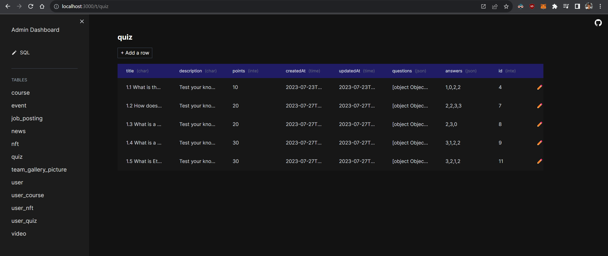

# Admin Dashboard / Database GUI



Admin dashboard that lets you connect a Postgres database and view all tables, edit rows, and run SQL queries.

Basic GUI for your database

Just define your database credentials in a `.env` file, and run the site locally `npm run dev`

**DO NOT deploy this to production because it exposes full access to the connected database. This is only meant to be used locally**

**Note: This project is super basic and still under construction.**

## Instructions

```
# npm install pnpm -g
pnpm install
pnpm dev
```

Open [http://localhost:3000](http://localhost:3000)

### Support

[Contact me](https://www.jbernier.com/) for hiring inquiries

# admin-dashboard
